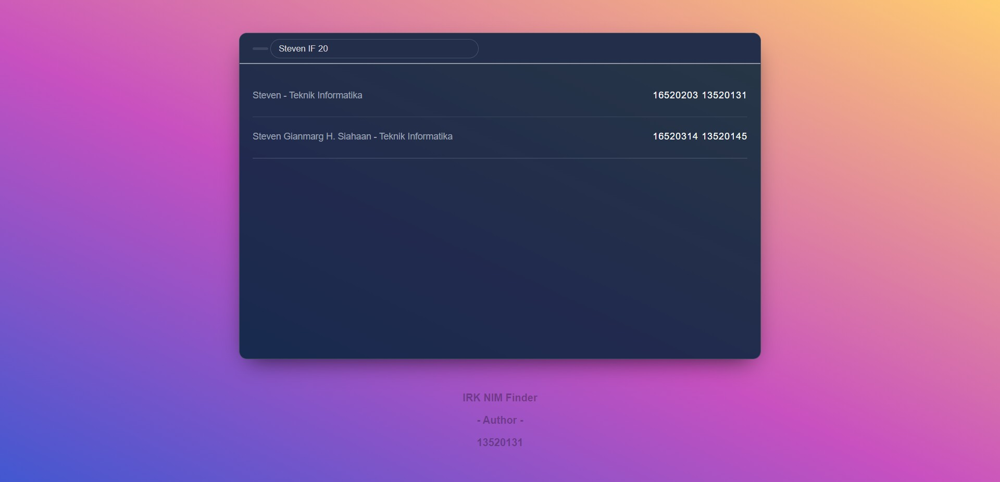

# IRK-NIM-Finder

## Deskripsi Tugas

Membuat NIM Finder dengan menggunakan regex dengan cara memanfaatkan data yang telah ada

Deskripsi lengkap tugas dapat dibaca pada tautan [ini](https://github.com/hokkyss/Seleksi-IRK-NIM_Finder).

## Teknologi dan Library yang Digunakan

-   HTML5
-   Javascript
-   CSS
-   ExpressJS
-   JSON
-   Heroku
-   Github
-   nodemon ( for dev )

## Production Repository

https://github.com/loopfree/IRK-NIM-FINDER-RELEASE

## How To Run

### Via Browser

1. Buka browser <strong><em>Chromium Based</em></strong>

2. Ketikkan
    ```bash
    https://nim-finder-13520131.herokuapp.com/
    ```
    Atau klik [tautan ini](https://nim-finder-13520131.herokuapp.com/)

### Via Terminal

Jalankan

1. npm install
2. node index.js

## Tampilan



